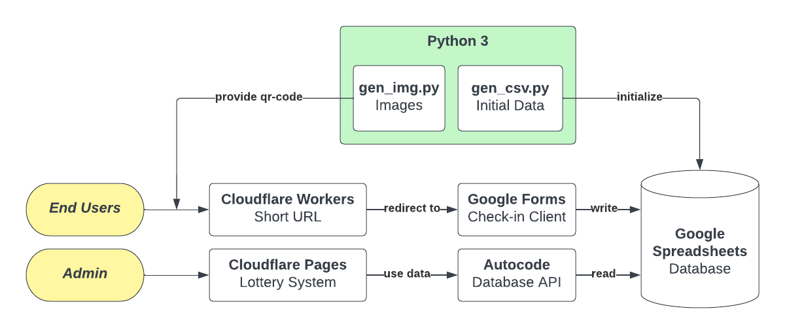

# UTCSSA 晚会签到系统

本仓库中的文件仅为组成签到系统的一部分。



- [x] 生成数据和图片 **（本仓库）**
- [x] 签到系统客户端（使用 Google Forms，使用 Cloudflare Workers 做短链接跳转）
- [x] 数据库（使用 Google Spreadsheets）
- [x] 数据库 API （使用 Autocode 搭建）
- [ ] 抽奖系统（计划使用 Vue.js 搭建一个 SPA ，部署在 Cloudflare Pages 或 Vercel）

## 准备

请使用 Python 3 运行本仓库的程序。若依赖未安装可以用以下命令安装：

```sh
pip3 install -r requirements.txt
```

## 程序列表

- `gen_csv.py`: 生成一个 CSV 文件，内含 300 个顺序排列的 ID 及对应生成的随机 UUID 。
- `gen_img.py`: 根据以上程序生成的 CSV 文件，生成对应的图片（存放在 `images/` 文件夹中）。见图例：


